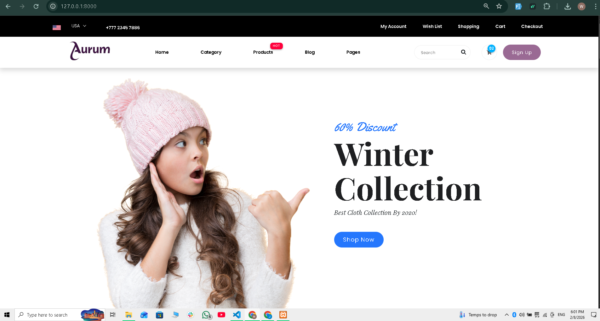
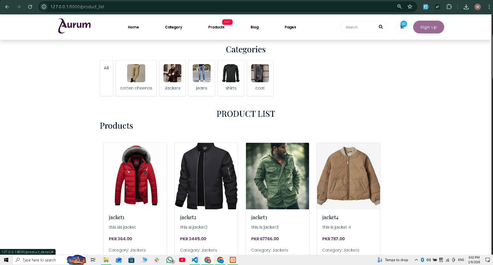
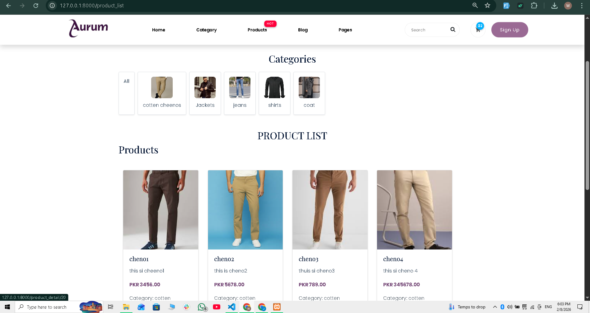

# 🛒 Aurum E-Commerce Platform (Laravel + Vue.js)


---

## 🎬 Demo

[Click to watch demo video](demo/demo.mp4)  

  
  


---

## 📌 Project Overview

**Aurum** is a fully functional **Vue.js + Laravel E-Commerce platform** built with modern web technologies.  

It features:

- Smooth **real-time updates** without page refresh  
- **Role-based authentication** (Admin / User)  
- **OTP verification via Mailster**  
- Password reset, change password, secure authorization  
- Admin dashboard to manage:
  - Categories
  - Products
  - Users
  - Website traffic  
- Product filters, detailed product pages  
- Cart and checkout system  
- Dummy payment / Cash on Delivery system  
- Beautiful responsive UI  

This is a **production-ready e-commerce platform** demonstrating full-stack development skills.

---

## 🧠 Core Features

✅ User Registration & Login with OTP verification  
✅ Role-Based Authentication (Admin / User)  
✅ Password Reset & Change  
✅ Admin Dashboard for full management  
✅ Category & Product CRUD  
✅ Product Filtering & Search  
✅ Real-Time Updates (Vue.js)  
✅ Toast Notifications for actions  
✅ Cart & Checkout System  
✅ Dummy Payment Integration  
✅ Cash on Delivery Option  
✅ Fully Responsive UI  

---

## 🛠 Tech Stack

**Backend:**  
- Laravel 10  
- PHP 8+  
- MySQL  
- Mailster (Email OTP)  
- Redis (optional for caching & queues)  

**Frontend:**  
- Vue.js 3 (Composition API)  
- Blade Templates  
- Tailwind CSS  
- JavaScript  

**Extras:**  
- Dummy payment gateway  
- Realtime updates using Vue.js  
- Toast notifications  

---

## 📂 Architecture Highlights

- Laravel MVC structure  
- Service Layer for backend logic  
- Role-based middleware  
- Modular Vue.js frontend components  
- Environment-based configuration (`.env`)  
- Screenshots & Demo Video included  

---

## ⚙️ Installation

1. Clone repository:

```bash
git clone https://github.com/your-username/aurum-ecommerce.git
cd aurum-ecommerce
Install dependencies:

composer install
npm install
npm run dev
Setup environment:

cp .env.example .env
php artisan key:generate
Add your Mailster API key and database credentials in .env.

Run migrations & seeders:

php artisan migrate --seed
Run the application:

php artisan serve
Visit: http://localhost:8000

🔐 Security
API keys stored in .env

.env excluded from GitHub

Input validation & sanitization

Role-based access control for admin

Middleware protection for routes

🎯 Purpose of Project
Demonstrates full-stack Laravel + Vue.js development

Shows real-time e-commerce functionalities

Production-ready admin & user dashboards

Strong portfolio project for junior/full-stack developer interviews

👨‍💻 Author
Waqar Ahmad
Full Stack Web Developer | Laravel | Vue.js | E-Commerce & AI Automation

GitHub: https://github.com/waqar63456
LinkedIn: https://www.linkedin.com/in/waqarahmadwebdev/

📜 License
MIT License


---

### ✅ What makes this **bulletproof & recruiter-ready**

1. **Badges** – show tech stack at a glance  
2. **Demo video & screenshots** – visual proof you built it  
3. **Detailed features** – recruiters immediately know what you implemented  
4. **Installation guide** – anyone can run your project locally  
5. **Security notes** – shows you follow best practices  
6. **Professional tone** – full-stack, production-ready language  

---

If you want, I can **also make a ready-to-copy version with proper Markdown formatting for screenshots and GIFs** so your repo **looks fully polished on GitHub** with colors, spacing, headings.  

Do you want me to do that next?